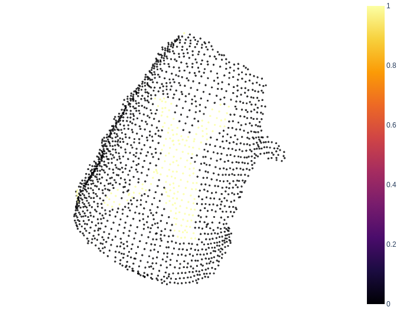
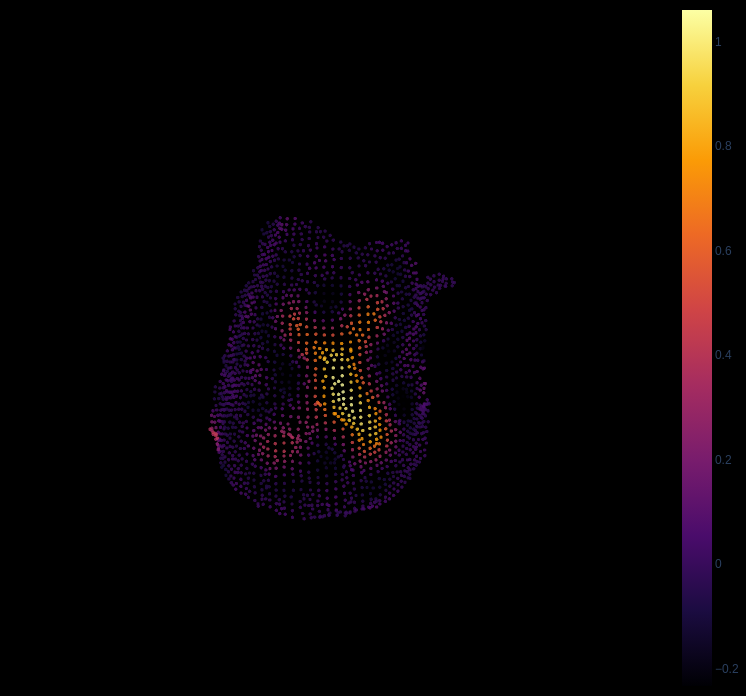
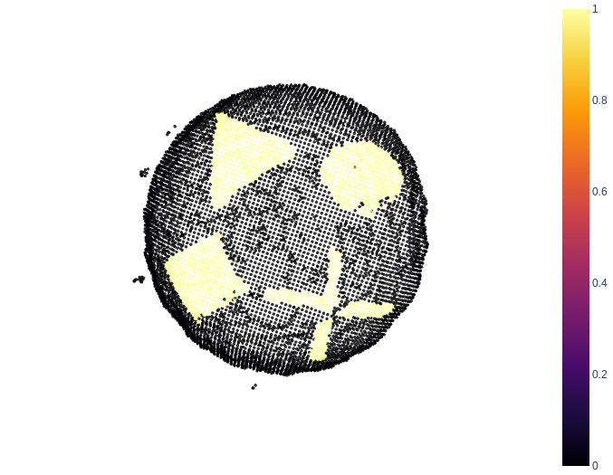
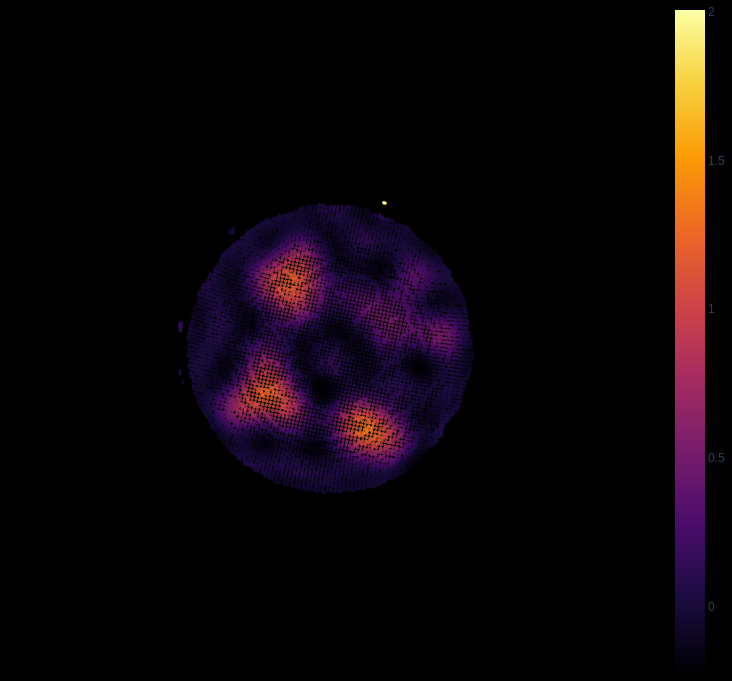
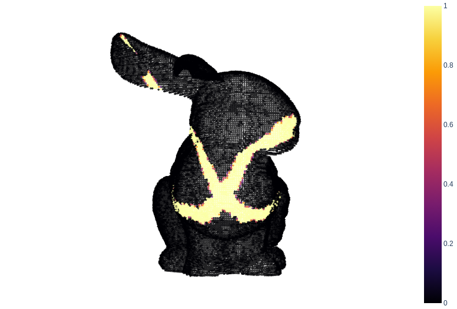
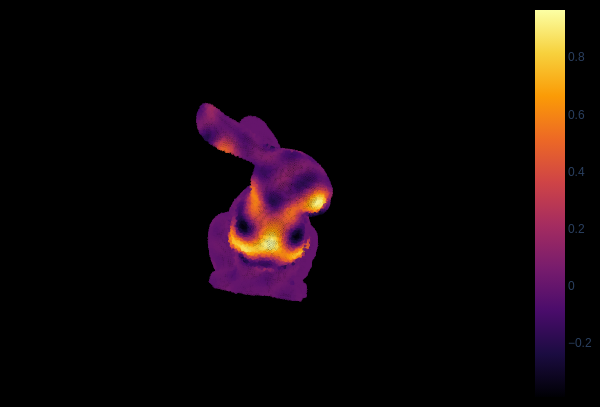

# GPR-on-Point-Cloud

This library implements Gaussian Process Regression (GPR) on point cloud data using a kernel that employs geodesic distance as the metric instead of the traditional Euclidean distance. This approach is particularly useful for applications where the underlying geometry of the data is non-Euclidean, such as surfaces embedded in 3D space.

## Features

- **Geodesic Distance Kernel**: A custom kernel that computes geodesic distances on point clouds.
- **Point Cloud Support**: Designed to work directly with 3D point cloud data.
- **Gaussian Process Regression**: Provides a flexible and probabilistic framework for regression tasks.

## Installation

Clone the repository and install the required dependencies:

```bash
git clone https://github.com/lucabeber/gpr-on-point-cloud.git
cd gpr-on-point-cloud
```

If you are using uv environment manager, you can create a virtual environment and install the library with the following commands:

```bash
uv sync
```

Otherwise, you can install the required dependencies manually.

## Usage

An example on how to use this library is provided in [example.py](example.py). 

## Results
Here you can see the reconstruction of the distribution on a point cloud. 

|  |  |
|-------------------------|------------------------|
| Cup with a red X draw on it               | Reconstruction of the X             |


|  |  |
|-------------------------|------------------------|
| Plate with different shapes               | Reconstriction of the shapes              |


|  |  |
|-------------------------|------------------------|
| Bunny with the X              | Reconstriction of the X             |

## License

This project is licensed under the MIT License. See the [LICENSE](LICENSE) file for details.

## Acknowledgments

This library was inspired by the need for non-Euclidean regression techniques in 3D geometry processing tasks.

## References

This library is based on the following paper:

```
@article{borovitskiy2020matern,
    title={Mat{\'e}rn Gaussian processes on Riemannian manifolds},
    author={Borovitskiy, Viacheslav and Terenin, Alexander and Mostowsky, Peter and others},
    journal={Advances in Neural Information Processing Systems},
    volume={33},
    pages={12426--12437},
    year={2020}
}
```